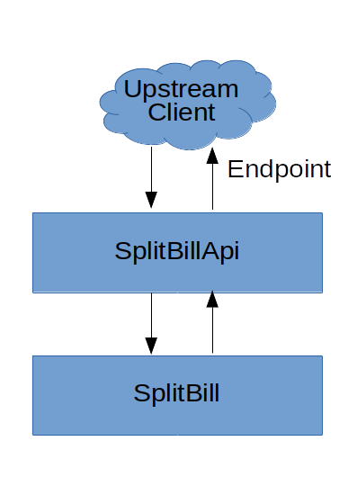

# SplitBillApi

## Description

Web API for split bill service.

## SLO and SLI

- Availability: 99%
- Rata-rata response time: < 20ms

## Architecture Diagram

## Owner

SRE

## Contact and On-Call Information

- Des Dulianto (des.dulianto@bukalapak.com) SRE

## Links

- [Golang](https://tour.golang.org/basics/1)
- [Write Go Code](https://golang.org/doc/code.html)
- [Go Dep](https://github.com/golang/dep)
- [Effective Go](https://golang.org/doc/effective_go.html)
- [Go Code Review](https://github.com/golang/go/wiki/CodeReviewComments)
- [Splitbill Library](https://github.com/desdulianto/splitbill)

## Onboarding and Development Guide

Prerequisite

- Go
- Go Dep
- [Splitbill library](https://github.com/desdulianto/splitbill) (automatically installed on install dependency step)

Running Test

Run test using `make test`

Running Application

1. Install dependency `dep ensure` or `make dep`
2. Run web service `go run app/web/main.go`
3. Access web service endpoint on http://localhost:8080

## Request Flows, Endpoints, and Dependencies

place description here.

## On-Call Runbooks

place description here.

## FAQ

place FAQ here.